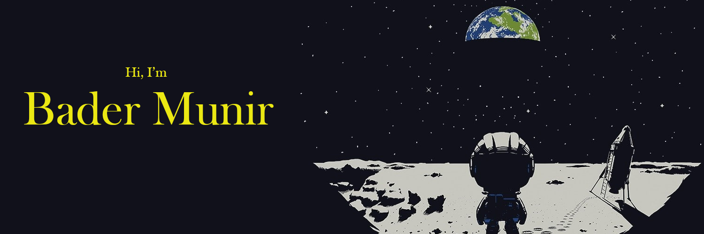

- 🔭 I’m currently working on React Projects
- 🌱 I’m currently learning Gsap
- 👯 I’m looking to collaborate on Projects
- 💬 Ask me about anything
- 📫 How to reach me: bader.munir18@googlemail.com

## 📌 Pinned Repositories

 

 

 

 

## &#x1f4c8; GitHub Stats

 

 
 

## 💼 Skills

